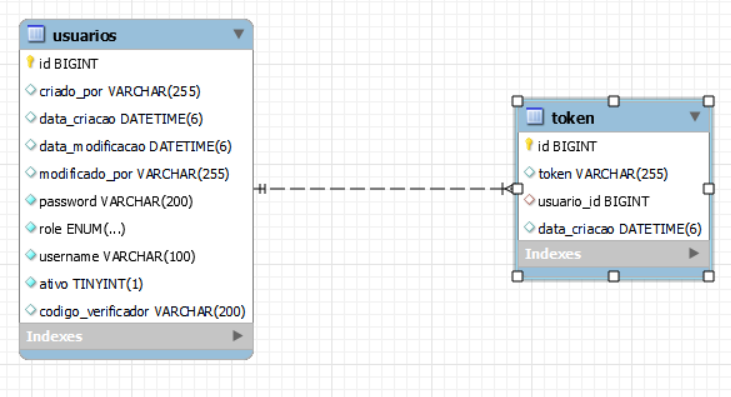

<h1 align="center">Documentação da API - ResidenciaTic18</h1>

## Park Manager API

A Park Manager API foi desenvolvida para oferecer uma solução abrangente de gestão de estacionamento. Até o momento, a API oferece uma gama de funcionalidades, incluindo registro de usuários, autenticação, recuperação de senha, gerenciamento de permissões de acesso e documentação no Swagger. Com endpoints simples e seguros, a API facilita operações essenciais de autenticação e gerenciamento de contas de usuário.

## Banco de Dados

## Autenticação

- **Autenticar Usuário**
  - Endpoint: `/api/v1/auth`
  - Método: `POST`

## Usuários

- **Criar Usuário**
  - Endpoint: `/api/v1/usuarios`
  - Método: `POST`
  
- **Obter Usuário por ID**
  - Endpoint: `/api/v1/usuarios/{id}`
  - Método: `GET`
  
- **Atualizar Senha**
  - Endpoint: `/api/v1/usuarios/{id}`
  - Método: `PATCH`
  
- **Listar Todos os Usuários**
  - Endpoint: `/api/v1/usuarios`
  - Método: `GET`

## Recuperação de Senha

- **Redefinir Senha por Username(e-mail)**
  - Endpoint: `/api/v1/password-recovery`
  - Método: `POST`

## Redefinição de Senha

- **Atualizar Senha por Token**
  - Endpoint: `/api/v1/password-reset/{token}`
  - Método: `PATCH`

